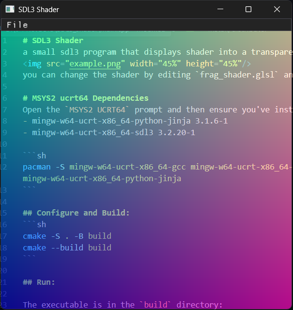

# SDL3 Shader
a small sdl3 program that displays shader into a transparent window that always stays on top.
  
you can change the shader by loading a glsl shader. 

# supported Uniforms 
- float u_time  = time from SDL_GetTicks()/1000.0f
- vec2 u_resolution = window size from SDL_GetWindowSize()
- vec2 u_mouse = mouse position from SDL_GetMouseState()
## shadertoy style uniform
- float iTime = same as u_time
- vec3 iResolution = x and y is the same as u_resolution while z is always 1.0f 
- vec4 iMouse = x and y is the same as u_mouse while zw is for button 
# MSYS2 ucrt64 Dependencies
Open the `MSYS2 UCRT64` prompt and then ensure you've installed the following packages.
- mingw-w64-ucrt-x86_64-python-jinja 3.1.6-1
- mingw-w64-ucrt-x86_64-sdl3 3.2.20-1

```sh
pacman -S mingw-w64-ucrt-x86_64-gcc mingw-w64-ucrt-x86_64-ninja mingw-w64-ucrt-x86_64-cmake mingw-w64-ucrt-x86_64-sdl3 mingw-w64-ucrt-x86_64-python-jinja
```

## Configure and Build:
```sh
cmake -S . -B build
cmake --build build
```

## Run:

The executable is in the `build` directory:
```sh
cd build
./main
```

## Install/distribute:
To make dist folder use:
```sh
cmake --install build --prefix ./dist
```

---

- https://glusoft.com/sdl3-tutorials/opengl-shaders-blur-sdl3/
- https://shadertoyunofficial.wordpress.com/2016/07/20/special-shadertoy-features/